# EclipseとGitlab連携

#### 1. Gitlabにログインし、新規プロジェクトを作成する

**プロジェクト名**：プロジェクト名
**Visibily Level**：プライベート

Gitlab：https://gitlab.com/users/sign_in

  

#### 2. 作成したプロジェクトにメンバーを追加する

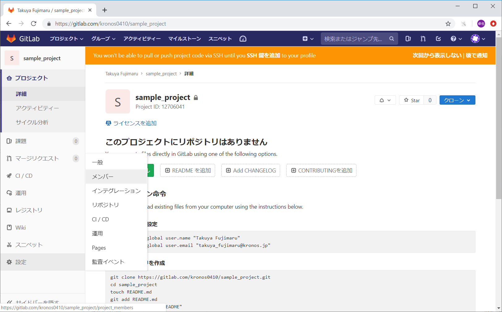

- 左メニュー > 設定 > メンバー

 

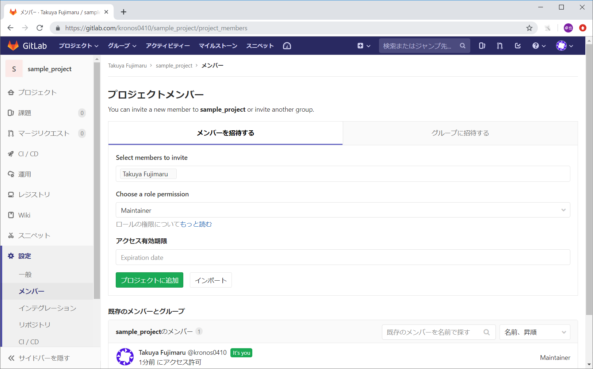

- 追加するメンバーを選択肢し、プロジェクトに追加する。
Select members to invite：追加するメンバーのアカウント名
Choose a role permission：Maintainer

 

#### EclipseでMavenプロジェクトを作成する

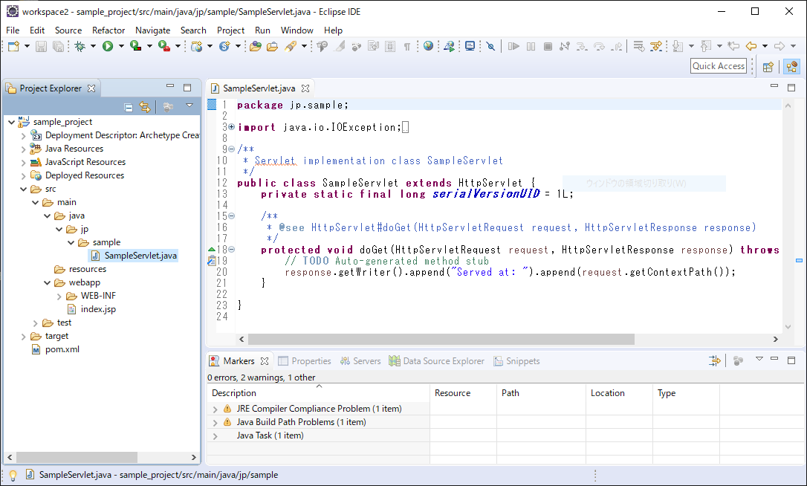

- 右クリックメニュー > Project > Maven > Maven Project

 

#### Gitlab連携（ローカルリポジトリを作成する）

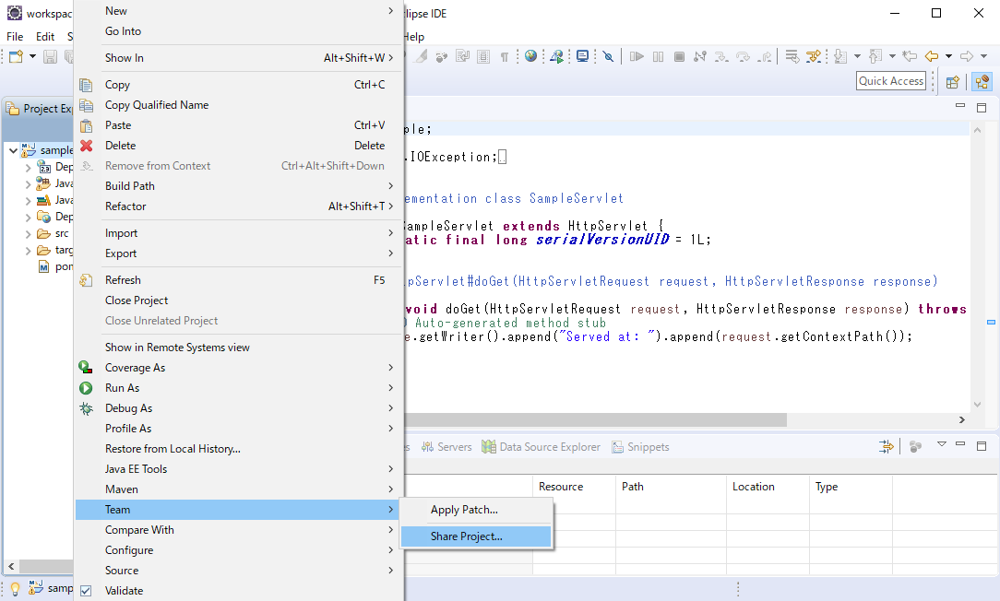

- プロジェクトを右クリック > Team > Share Project

 

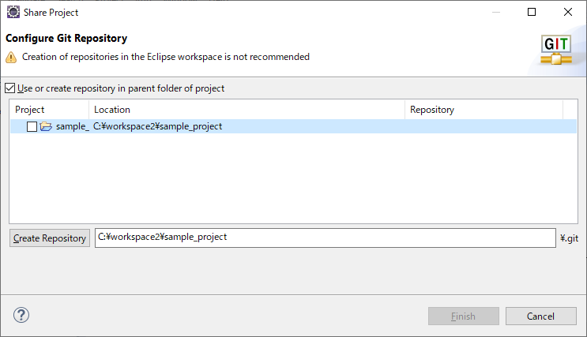

- Use or create repository in parent folder of projectにチェックする
- 一覧から対象のプロジェクトを選択する
- Create Repositoryボタンをクリックする

 

- Finishボタンをクリックする

 

#### Gitlab連携（pom.xmlを更新する）

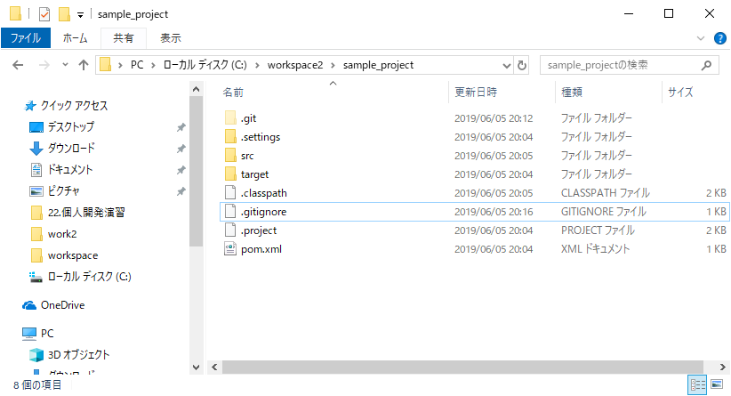

- Explorerからworkspace > 対象プロジェクトのフォルダ
- 下記リンク先のpom.xmlで上書き保存する

<a href="/file/pom.xml">pom.xml</a>

 

#### Gitlab連携（ローカルリポジトリにコミットする）

- プロジェクトを右クリック > Team > Commit

 

> ServersやConsoleなどのブロックに「Git Staging」のタブが表示される

 

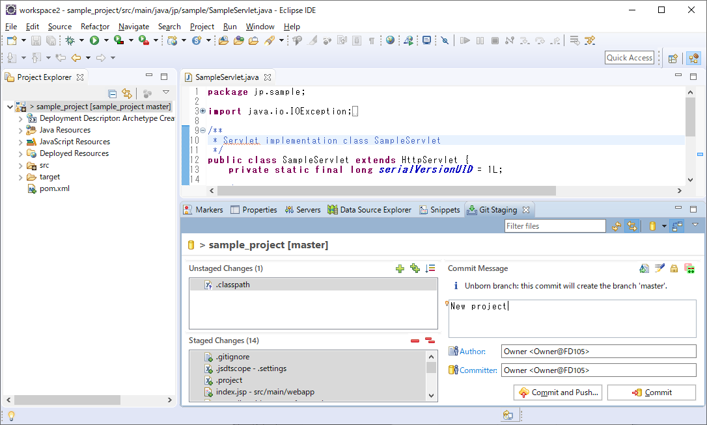

- +ボタンを押して、[Unstaged Changes] にあるファイルを [Staged Changes] に移す
- [Commit]ボタンをクリックする

 

#### Gitlab連携（リモートリポジトリにプッシュする）

- プロジェクトを右クリック > Team > Remote > Push

 

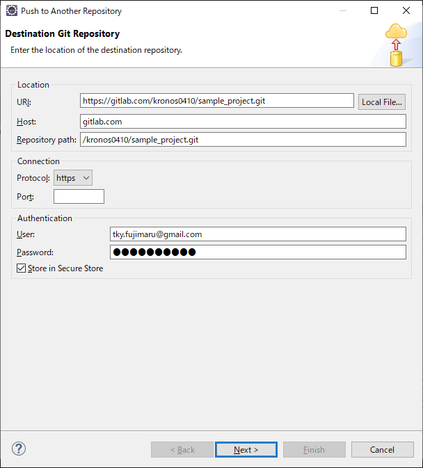

- 連携先のGitlab（リモートリポジトリ）の情報を入力する
**URI**: 対象リモートリポジトリのURI
**User**: あなたのGitlabアカウントのメールアドレス
**Password**: あなたのGitlabアカウントのパスワード
**Store in Secure Store**: チェックする

 

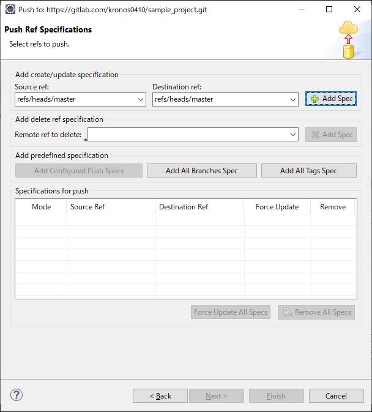

- masterリポジトリを追加する
**Source ref**: [refs/heads/master]を選択する
**Destination ref**: [refs/heads/master]を選択する
- [Add Spec]ボタンをクリックする

> 下部の一覧にmasterリポジトリが追加される

 

- [Next]ボタンをクリックする

 

- [Close]ボタンをクリックする

> エラーがなければ、masterリポジトリにプッシュされたことが確認できる

 

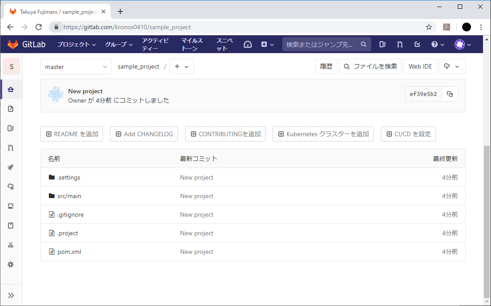

> Gitlab上の対象プロジェクトを見ると、Eclipseで作成したプロジェクトの構成が連携されていることが確認できる

 

#### GitlabからEclipseに取り込む

- Eclipseのプロジェクト・エクスプローラー内で右クリック > Import
- Git > Projects from Git を選択する
- [Next]ボタンをクリックする

 

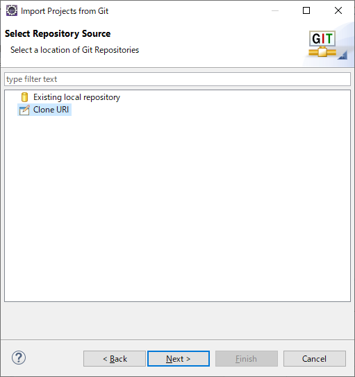

- [Clone URL]を選択する
- [Next]ボタンをクリックする

 

- 取り込む対象のGitlab（リモートリポジトリ）の情報を入力する
**URI**: 対象リモートリポジトリのURI
**User**: あなたのGitlabアカウントのメールアドレス
**Password**: あなたのGitlabアカウントのパスワード
**Store in Secure Store**: チェックする

 

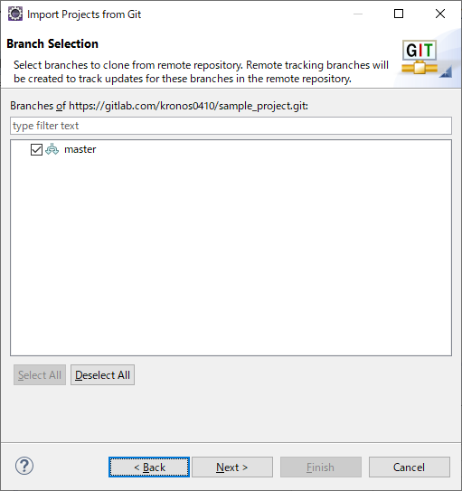

- master にチェックされた状態で、[Next]ボタンをクリックする

 

- 取り込み先を指定する
**Directory**: Eclipseのworkspaceを指定する
- [Next]ボタンをクリックする

 

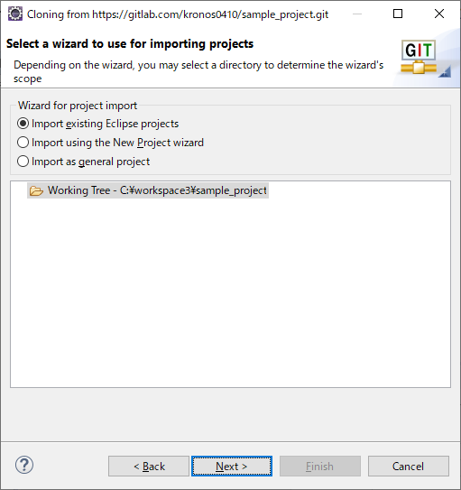

- [Import existing Eclipse projects]を選択する
- [Next]ボタンをクリックする

 

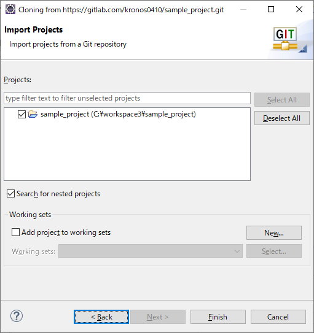

- 対象プロジェクトが選択された状態で、[Finish]ボタンをクリックする
