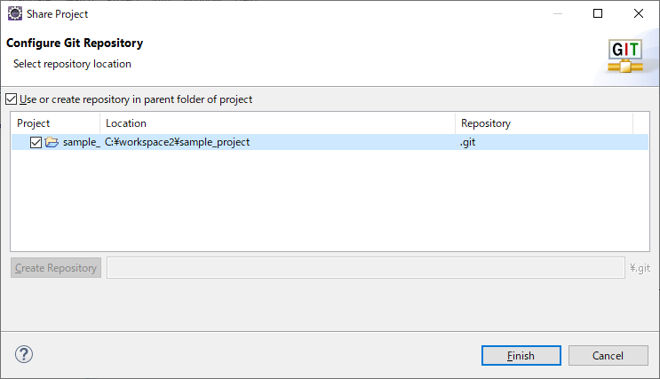
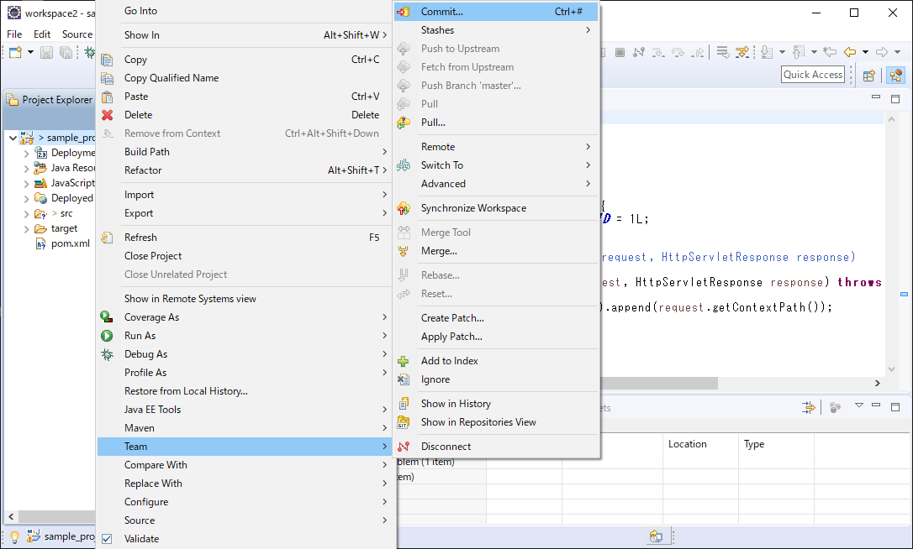
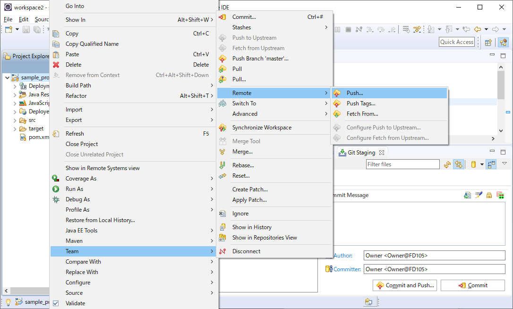
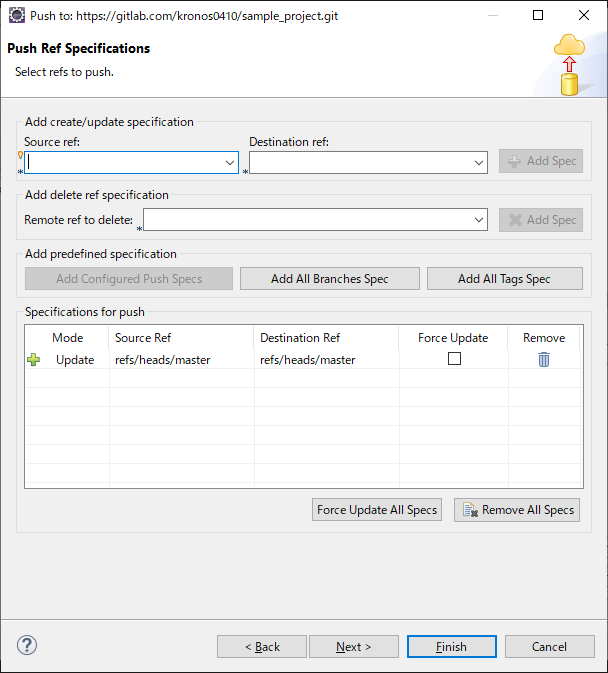
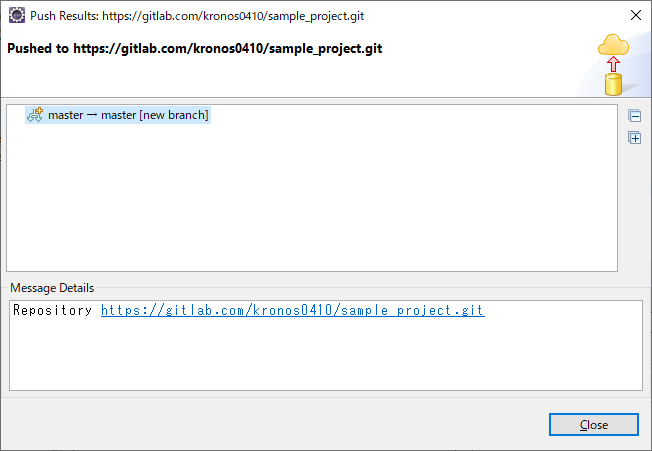

# EclipseとGitLab連携

## 3. GitLab連携（プロジェクトの配置）

作成したMavenプロジェクトをGitLabのリモートリポジトリ（masterブランチ）にアップロードします。

### 3-1. ローカルリポジトリを作成する

- プロジェクトを右クリック > Team > Share Project

 

- [Use or create repository in parent folder of project]にチェックする
- 一覧から対象のプロジェクトを選択する
- [Create Repository]ボタンをクリックする

 

- [Finish]ボタンをクリックする

 

### 3-2. ローカルリポジトリにコミットする

リモートリポジトリにアップロードするファイル群をローカルリポジトリに保持します。

- プロジェクトを右クリック > Team > Commit

 

> ServersやConsoleなどのブロックに「Git Staging」のタブが表示される

 

- +ボタンを押して、[Unstaged Changes] にあるファイルを [Staged Changes] に移す
- [Commit]ボタンをクリックする

 

### 3-3. リモートリポジトリにプッシュする

ローカルリポジトリに保持しているファイル群をGitLabのリモートリポジトリにアップロードします。

- プロジェクトを右クリック > Team > Remote > Push

 

- 連携先のGitLab（リモートリポジトリ）の情報を入力する 
**URI**: 対象リモートリポジトリのURI 
**User**: あなたのGitLabアカウントのメールアドレス 
**Password**: あなたのGitLabアカウントのパスワード 
**Store in Secure Store**: チェックする

 

- masterリポジトリを追加する 
**Source ref**: [refs/heads/master]を選択する 
**Destination ref**: [refs/heads/master]を選択する
- [Add Spec]ボタンをクリックする

> 下部の一覧にmasterリポジトリが追加されます。

 

- [Next]ボタンをクリックする

 

- [Close]ボタンをクリックする

> エラーがなければ、masterリポジトリにプッシュされたことが確認できます。

 

> GitLab上の対象プロジェクトを見ると、Eclipseで作成したプロジェクトの構成が連携されていることが確認できます。

 

<a href="04-import-project.md">>> 04. GitLab連携（プロジェクトの取り込み）</a>

<a href="../README.md">>> メニューへ</a>
