# EclipseとGitLab連携

## 4. GitLab連携（プロジェクトの取り込み）

開発チーム内の各メンバーは、GitLabのリモートリポジトリ（masterブランチ）にあるプロジェクトをローカルに取り込んで開発を行います。

### 4-1. GitLabからEclipseに取り込む

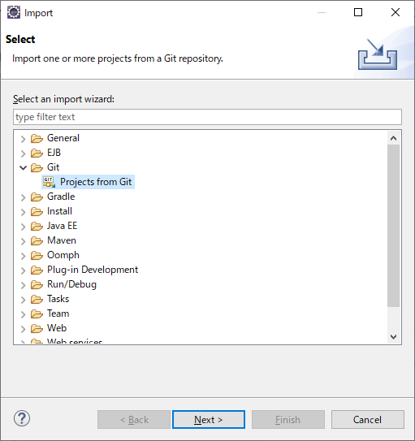

- Eclipseのプロジェクト・エクスプローラー内で右クリック > Import
- Git > Projects from Git を選択する
- [Next]ボタンをクリックする

 

- [Clone URL]を選択する
- [Next]ボタンをクリックする

 

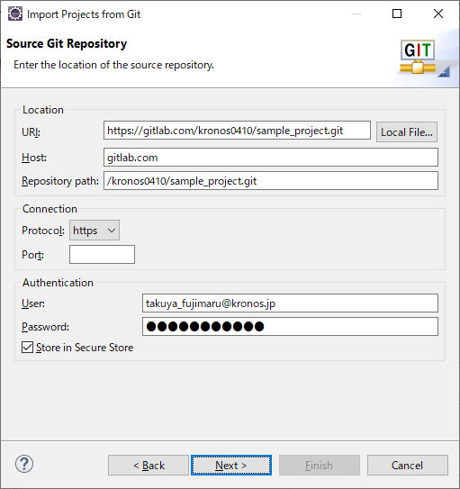

- 取り込む対象のGitLab（リモートリポジトリ）の情報を入力する 
**URI**: 対象リモートリポジトリのURI 
**User**: あなたのGitLabアカウントのメールアドレス 
**Password**: あなたのGitLabアカウントのパスワード 
**Store in Secure Store**: チェックする

 

- master にチェックされた状態で、[Next]ボタンをクリックする

 

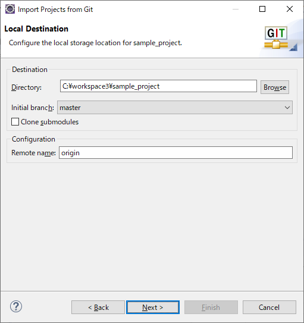

- 取り込み先を指定する
**Directory**: Eclipseのworkspaceを指定する
- [Next]ボタンをクリックする

 

- [Import existing Eclipse projects]を選択する
- [Next]ボタンをクリックする

 

- 対象プロジェクトが選択された状態で、[Finish]ボタンをクリックする

 

### 4-2. 取り込んだプロジェクトの環境整備

GitLabから取り込んだプロジェクトは設定（フォルダ構成）が崩れている可能性があります。 Eclipseのビルドパスの構成で環境を整えましょう。

プロジェクトを右クリック > Build Path > Configure Build Path

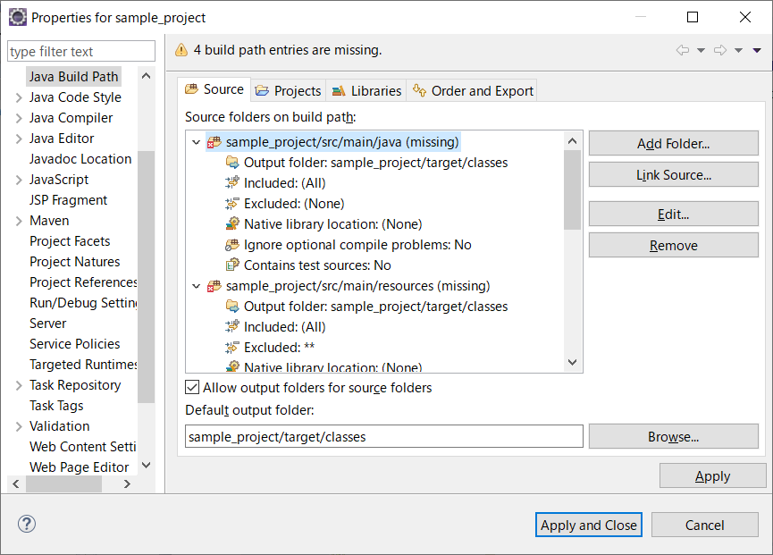

- [Source]タブで **(missing)** となっているフォルダを削除する 
missingのフォルダを選択する 
[Remove]ボタンをクリックする

 

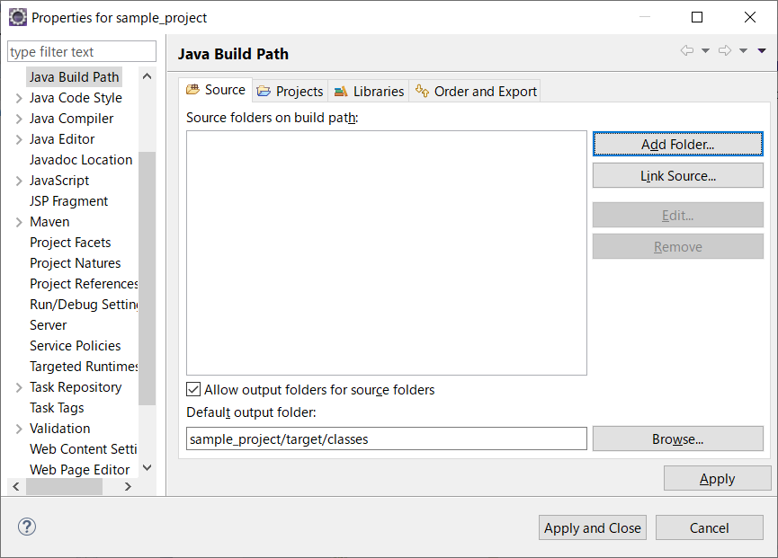

- [Add Folder]ボタンをクリックする

 

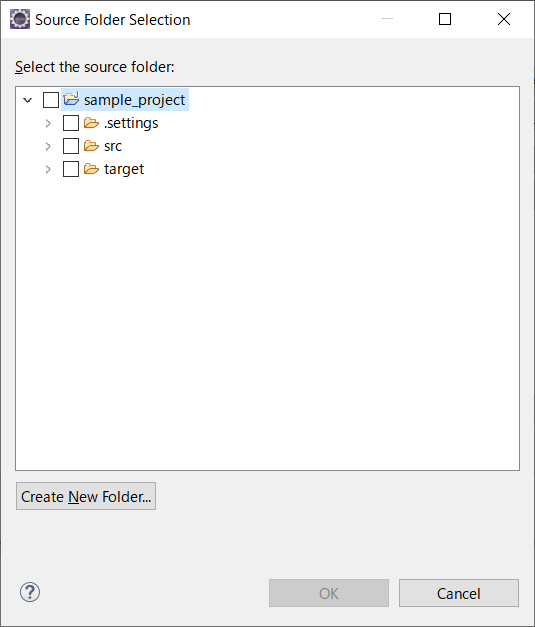

- 一覧からプロジェクト（画像ではsample_project）を選択して、[Create New Folder]ボタンをクリックする

 

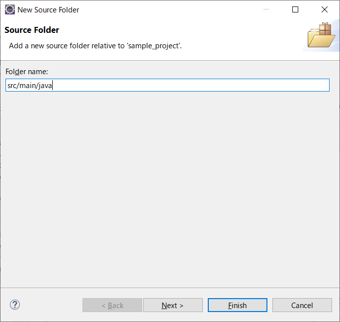

- 「**src/main/java**」を入力して、[Finish]ボタンをクリックする

> 同様に「**src/main/resources**」も作成し、次の画像のような構成にしてください。

 

- [OK]ボタンをクリックする

 

- [Apply]ボタンをクリックする
- src/main/javaフォルダの **Output folder** をダブルクリックする

 

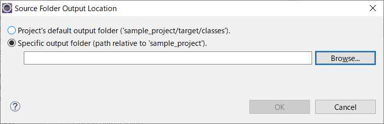

- [Specific output folder ...]を選択し、[Browse]ボタンをクリックする

 

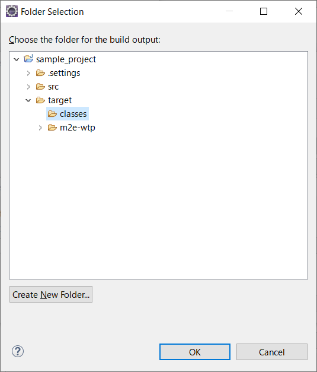

- **target > classes**フォルダを選択して、[OK]ボタンをクリックする

 

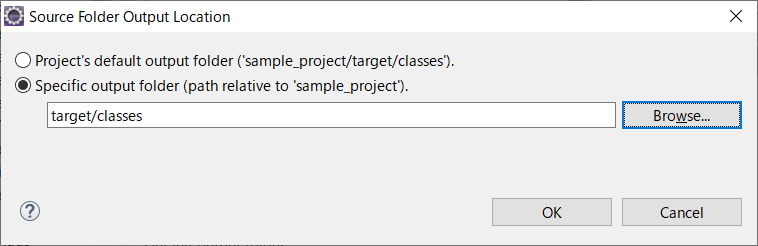

- [OK]ボタンをクリックする

> 上記までの Output folder の設定を src/main/resourcesフォルダに対しても行います。

 

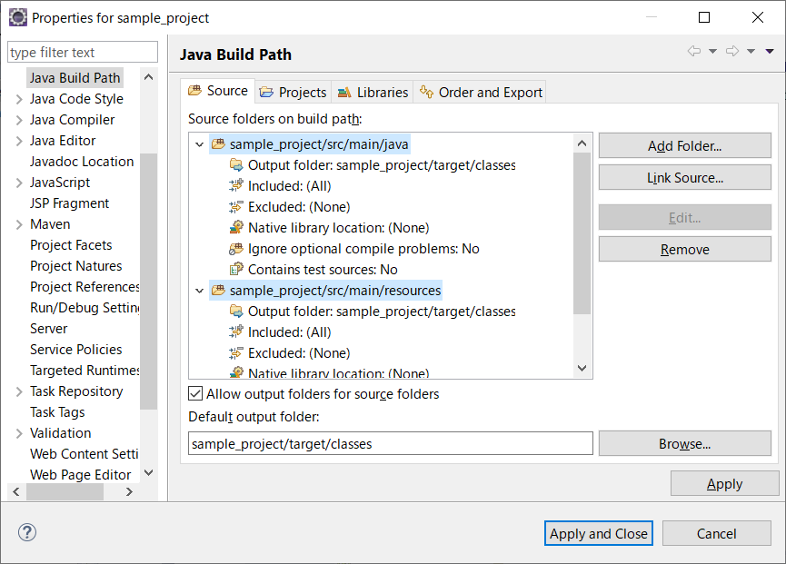

- [Apply and Close]ボタンをクリックする

 

<a href="05-switch-branch.md">>> 05. ブランチによる開発</a>

<a href="../README.md">>> メニューへ</a>
