# EclipseとGitLab連携

## 5. ブランチによる開発

Gitの**ブランチ**とは、成果物（プログラムなど）の履歴を記録していく機能のことです。最終的な成果物（リリース版）は **masterブランチ** に集約されます。 しかし、開発者全員がそれぞれ作成したプログラムを直接masterブランチに対してアップしていくと、**コンフリクト**を起こす可能性が高まります。

> **コンフリクト**とは、複数の開発者が同じファイルを編集し、リモートリポジトリにプッシュすることで起きる競合（編集情報の重複）のことです。 コンフリクトについては、次章で解説します。

そのため、複数の開発者でバージョン管理をする場合、機能や作業ごとにブランチを作成し、作成したブランチに対してプログラムをプッシュします。

> 機能や作業ごとに作成するブランチを**トピックブランチ**と言います。 それに対してmasterブランチを**統合ブランチ**と言います。

作業が完了したらトピックブランチをmasterブランチへ **マージ（統合）** します。

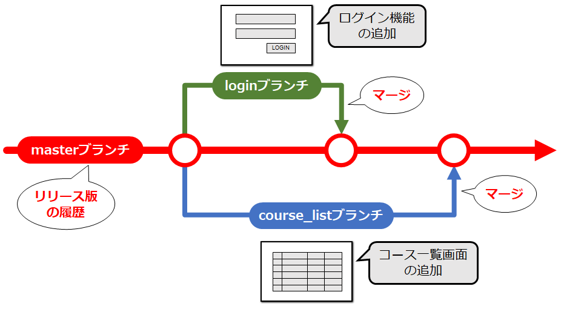

  

### 5-1. トピックブランチを作成する

- プロジェクトを右クリック > Team > Switch To > New Branch

 

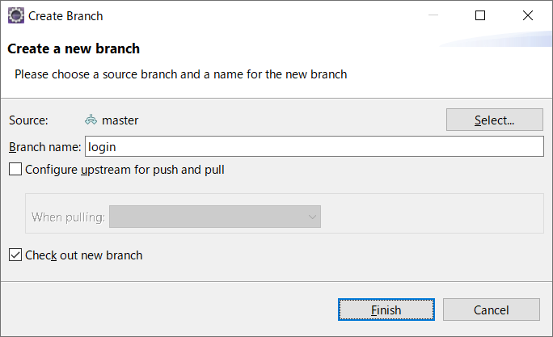

- ブランチ名を入力して新規にブランチを作成する 
**Branch name**: 作成するブランチ名
- [Finish]ボタンをクリックする

 

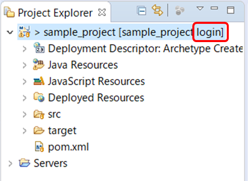

> Eclipse上のプロジェクトに対応するブランチ名が変わっていることが確認できます。

 

### 5-2. トピックブランチに成果物をプッシュする

それでは、１つの機能を作成し、トピックブランチにプッシュしましょう。

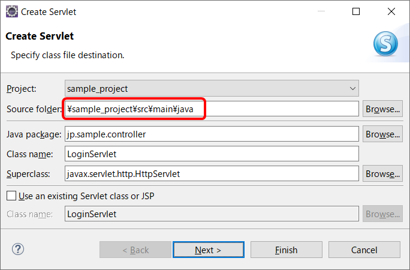

- 該当機能に必要なサーブレットやJSPを作成していきます。

> サーブレットの場合、作成時の[Source folder]が **src/main/java** になっていることを確認してください。

 

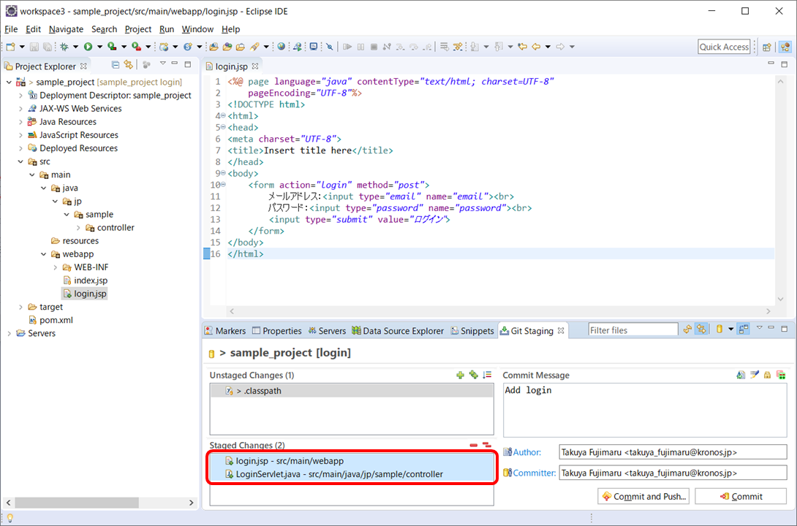

- プログラムを作成し終えたら、対象のファイルをステージングエリア（Staged Changes）に追加する
- [Commit and Push]ボタンをクリックする

 

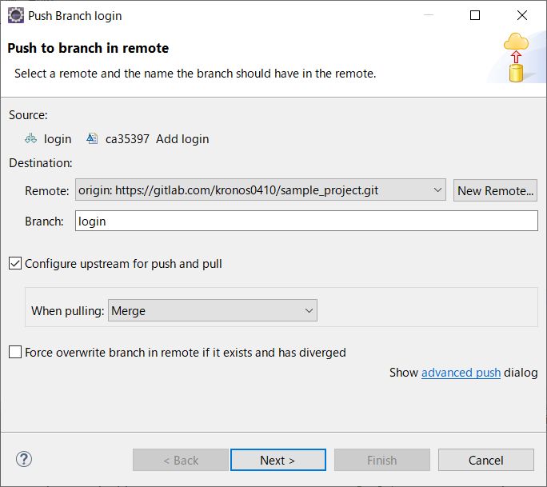

- **Branch**が作成したブランチになっていることを確認し、[Next]ボタンをクリックする

 

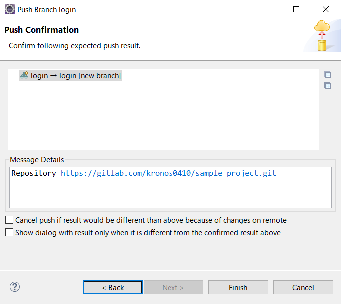

- [Finish]ボタンをクリックする

 

- [Close]ボタンをクリックする

 

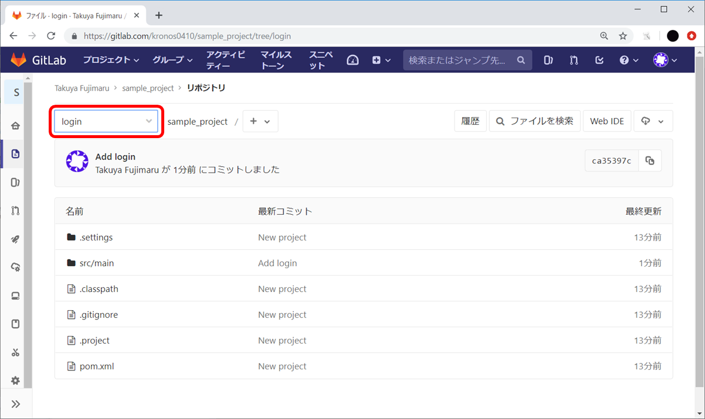

> GitLab上でブランチを切り替えると、プッシュした内容が反映されていることが確認できます。

 

### 5-3. トピックブランチをmasterブランチに統合する

作成したプログラムをトピックブランチに反映させたら、トピックブランチの内容をmasterブランチに **マージ（統合）** します。 マージするには、まずmasterブランチに切り替える必要があります。

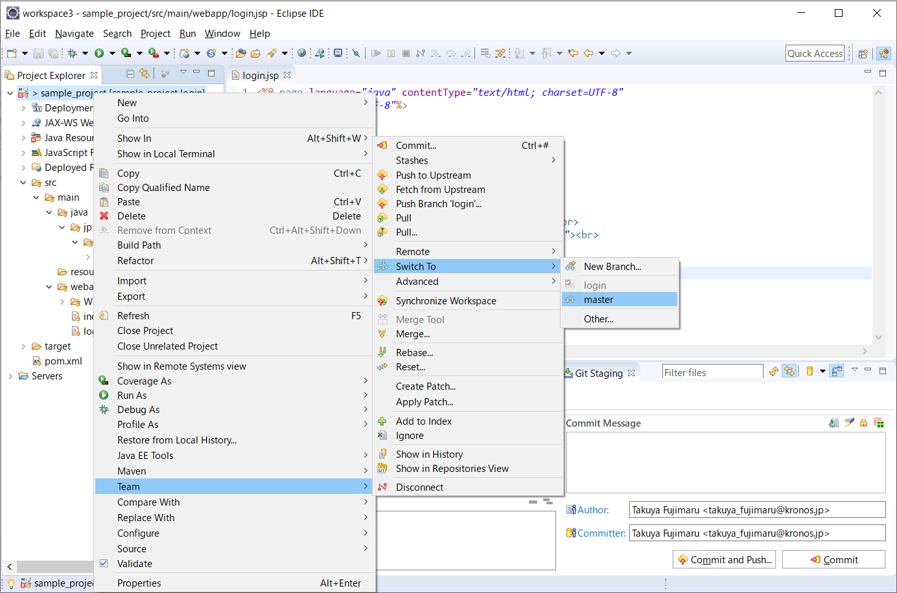

- プロジェクトを右クリック > Team > Switch To > master

 

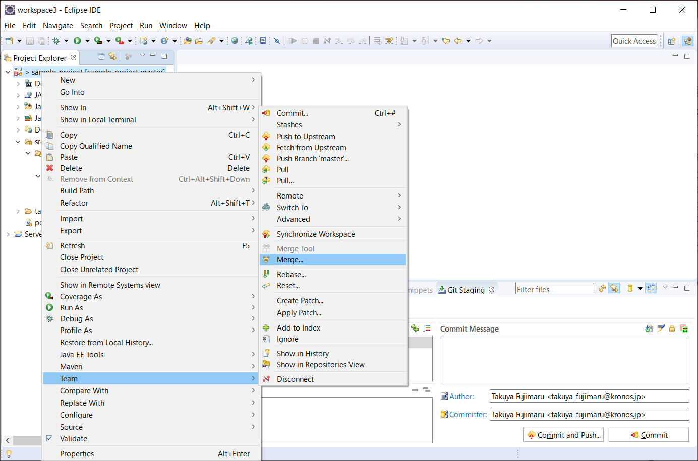

- プロジェクトを右クリック > Team > Merge

 

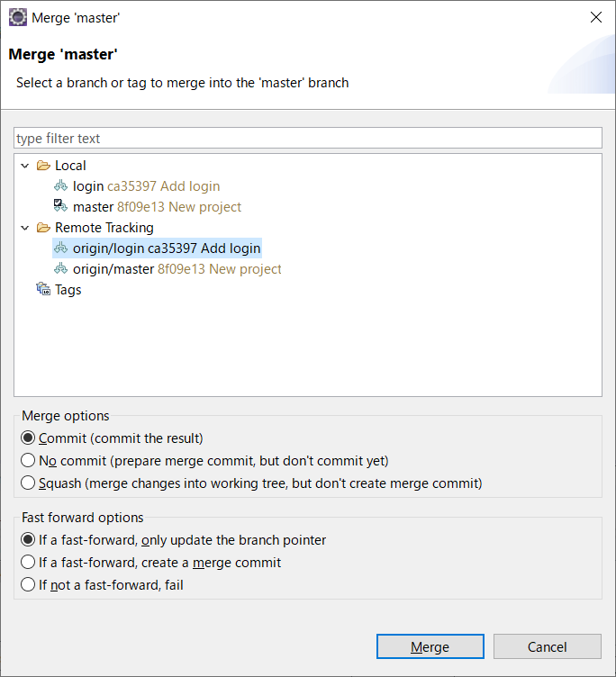

- masterブランチにマージするブランチを選択する
- [Merge]ボタンをクリックする

 

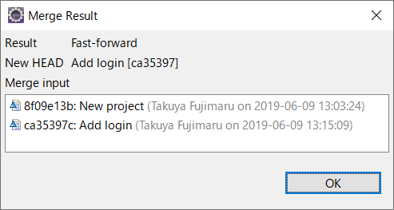

- マージ結果画面で[OK]ボタンをクリックする

 

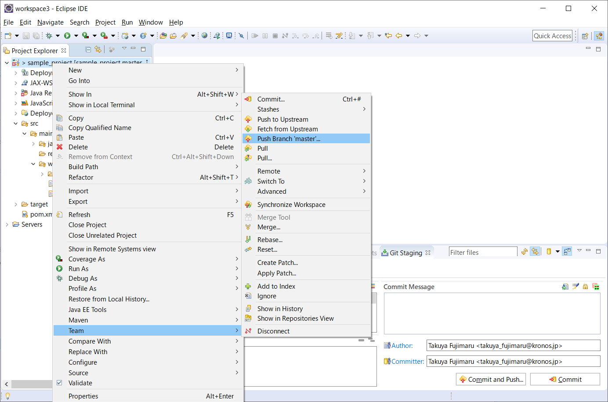

- プロジェクトを右クリック > Team > Push Branch 'master'

 

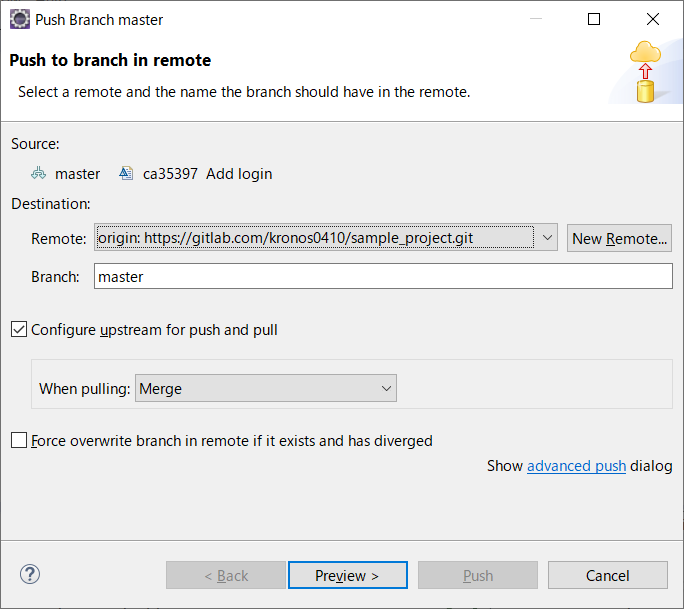

- [Preview]ボタンをクリックする

 

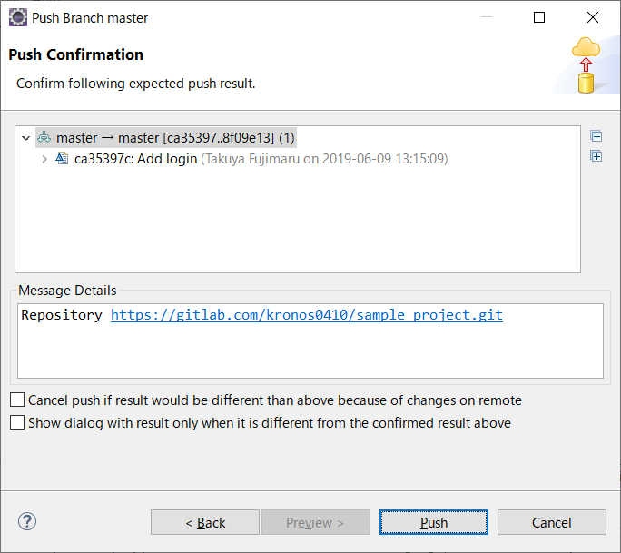

- [Push]ボタンをクリックする

 

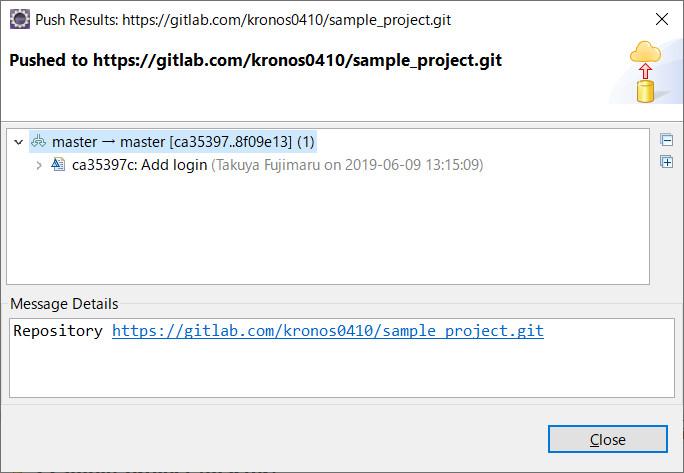

- [Close]ボタンをクリックする

 

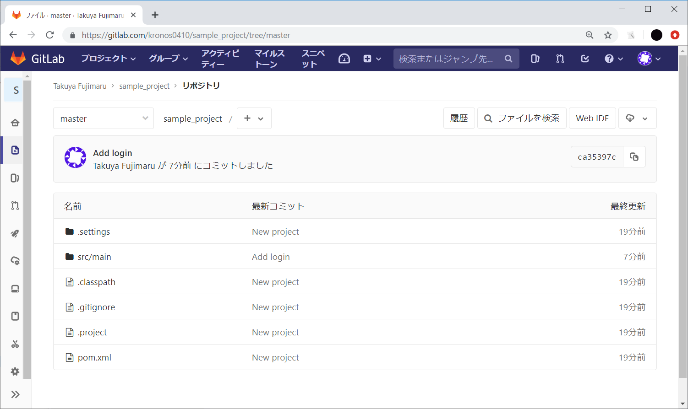

> GitLab上で、トピックブランチの内容がmasterブランチに反映されていることが確認できます。

 

### 5-4. 最新のmasterブランチを取り込む

他の開発者は、masterブランチに切り替えてプルをすることで、マージされた内容も含めて取り込むことができます。

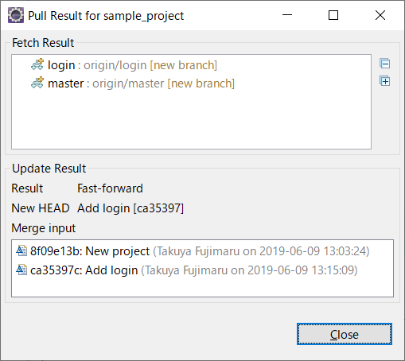

  

<a href="06-conflict.md">>> 06. コンフリクトと対処方法</a>

<a href="../README.md">>> メニューへ</a>
