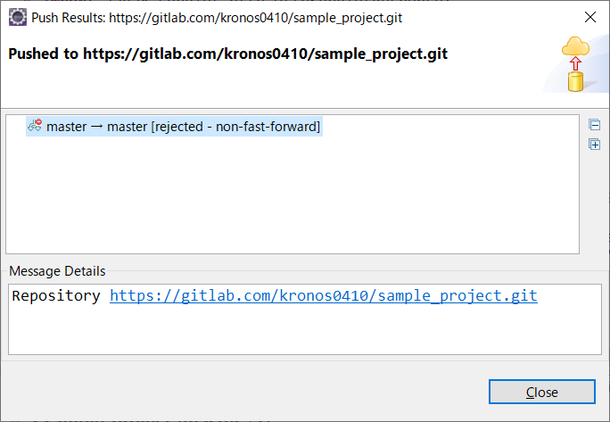
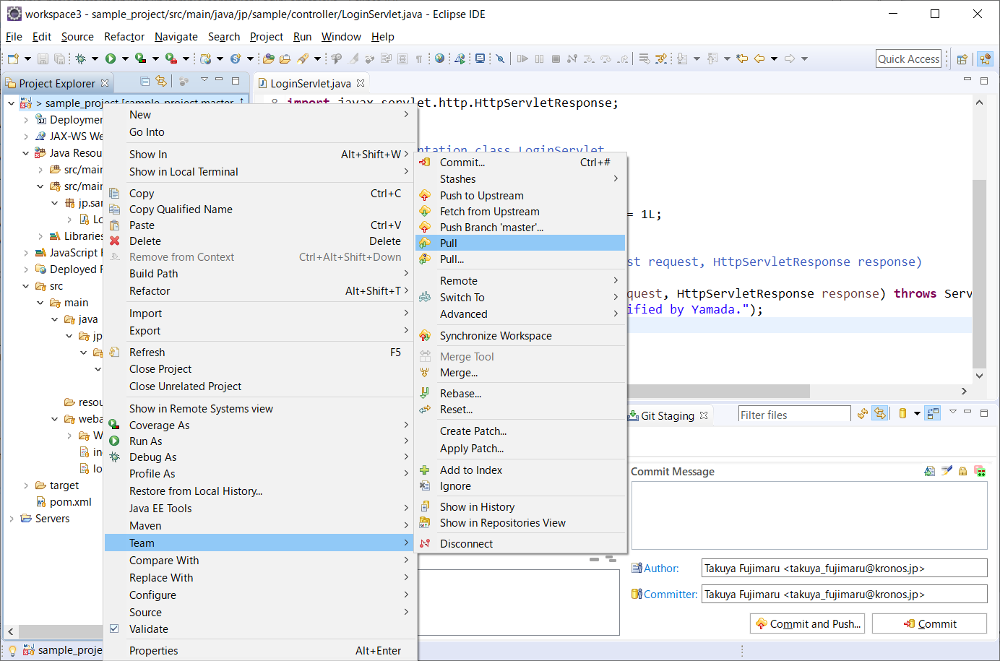
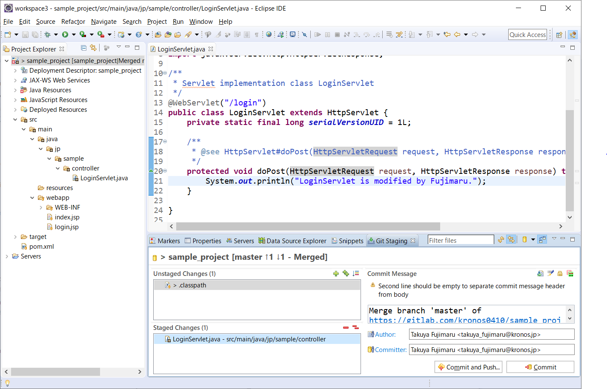
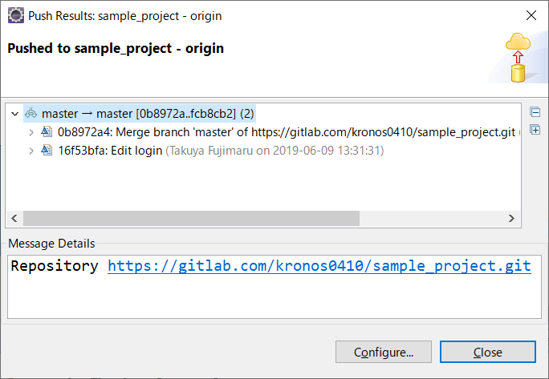

# EclipseとGitLab連携

## 6. コンフリクトと対処方法

複数のメンバーでGitによるバージョン管理をしていると、コンフリクトを起こす可能性があります。<br>**コンフリクト**とは、複数の開発者が同じファイルを編集し、リモートリポジトリにプッシュすることで起きる競合（編集情報の重複）のことです。<br>例えば、開発者Aと開発者Bが同時に SampleServlet.java を修正します。開発者Aが修正したプログラムをmasterブランチにプッシュした後に開発者Bがプッシュすると、すでに開発者Aが更新しているため修正内容の競合（コンフリクト）が起きます。<br>ここでは、コンフリクトが起きた時の対処方法を見ていきます。

まず、masterブランチにプッシュしてコンフリクトが起きると、以下のように「rejected」といったメッセージが表示されます。



- [Close]ボタンをクリックする

<br>



- プロジェクトを右クリック > Team > Pull

<br>

競合した箇所は、次の画面のように表示されます。

```
<<<<<<<< heads
         [先にプッシュされた内容]
========
         [あなたがプッシュしようとした内容]
>>>>>>>> branch 'master' of https: ...
```


- 競合メッセージを削除し、反映させる内容に修正する。

<br>



- コードを修正したら、ステージングエリアに追加して[Commit and Push]ボタンをクリックする

<br>



- [Close]ボタンをクリックする

<br>


> プッシュし直した内容でmasterブランチが更新されます。

<br>

<a href="../README.md">>> メニューへ</a>
