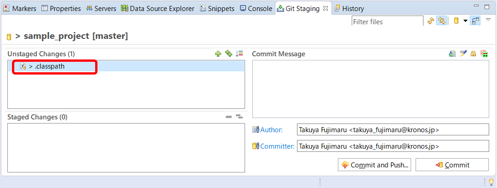
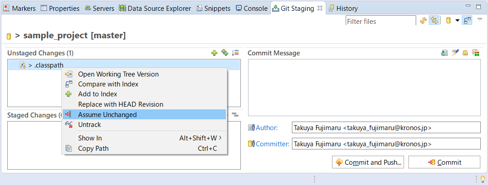
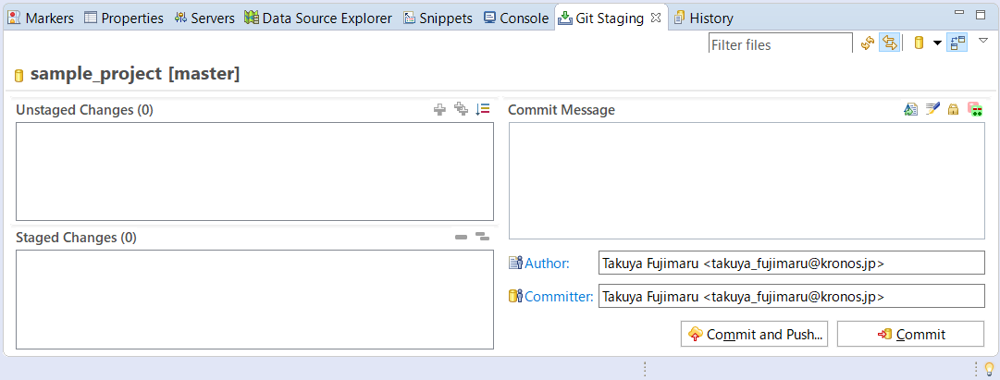

# EclipseとGitLab連携

## 7. コミット対象外の設定

Eclipseの Configure Build Path（ビルドパスの構成）でプロジェクトの設定を変えたりすると、**.classpath**という設定ファイルもコミット対象として Git Stagingタブの ***Unstaged Changes*** の欄に追加されます。

.classpathのファイルをリモートリポジトリにコミット、プッシュすると、リモートリポジトリからプロジェクトを取り込んだ他の開発者の設定も変更され、正常に動作しなくなる可能性があります。

こうした事象を避けるために、.classpathなどの設定ファイルはコミット対象外（共有対象外）とすべきです。

 

### 7-1. 設定ファイルをコミット対象外とする

- 対象外とするファイルを右クリック > *Assume Unchanged*

 

> *Unstaged Changes* の欄から.classpathファイルがなくなります。

 

<a href="08-maven-jndi.md">>> 08. Mavenプロジェクトにおけるコネクションプール（JNDI）</a>

<a href="../README.md">>> メニューへ</a>
