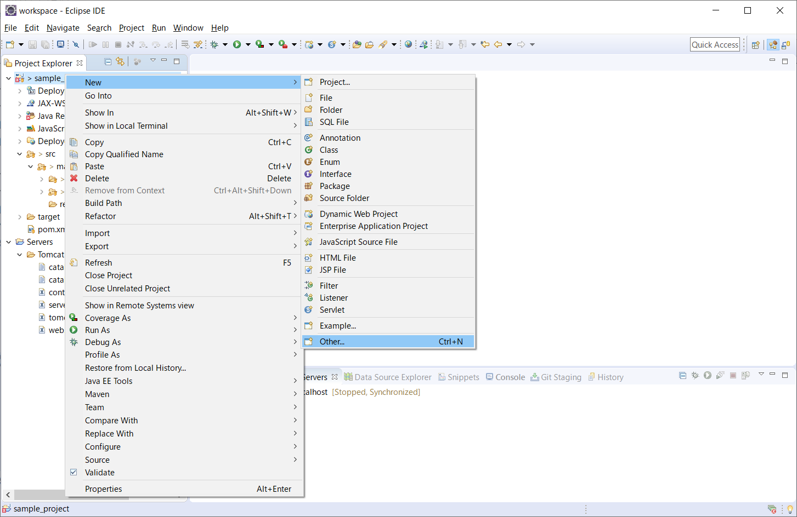
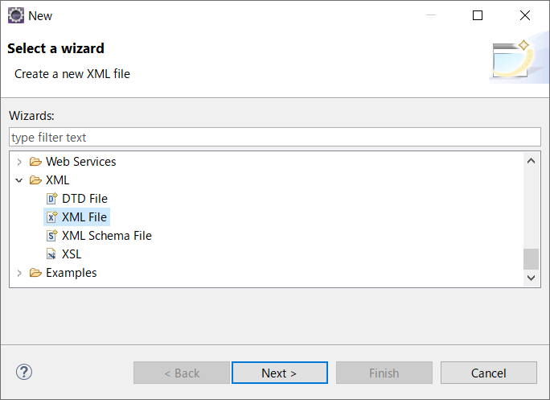
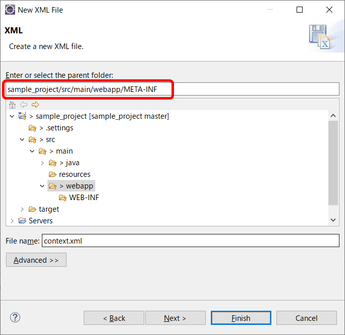

# EclipseとGitLab連携

## 8. Mavenプロジェクトにおけるコネクションプール（JNDI）

Mavenプロジェクトでコネクションプールを利用する場合、***context.xml*** にデータソース（DBへの接続情報）を定義します。<br>更に、定義する接続情報をGit経由で他メンバーと共有する場合、各PCの環境に依存するServersフォルダのcontext.xmlを編集するのではなく、Mavenプロジェクト内にcontext.xmlを用意するといいです。

<br>

### 8-1. context.xmlを作成する



- プロジェクトを右クリック > New > Other...

<br>



- 一覧の中から「**XML File**」を選択し、[Next]ボタンをクリックする

<br>



- XMLファイルの作成場所とファイル名を指定する（**META-INF**フォルダ内に作成する）<br>
**Parent folder**: src/main/webapp/META-INF<br>
**File name**: context.xml
- [Finish]ボタンをクリックする

<br>

### 8-2. context.xmlを編集する

作成したcontext.xmlにデータソースを定義します。（下記参照）

```xml
<?xml version="1.0" encoding="UTF-8"?>
<context>
    <Resource name="jdbc/knowledge" auth="Container"
        type="javax.sql.DataSource"
        driverClassName="com.mysql.cj.jdbc.Driver"
        url="jdbc:mysql://localhost:3306/knowledge?useSSL=false&amp;serverTimezone=JST"
        username="app-user" password="Kn0w1eDgE" maxTotal="100" maxIdle="50"
        maxWaitMillis="5000" />
</context>
```

あとは、定義したコネクションプールを利用するJavaプログラムを用意することでDB接続が可能となります。

[利用手順]<br>
- JNDIのAPIであるInitialContextインスタンスを生成する
- InitialContextインスタンスからDataSourceインスタンスを取得する
- DataSourceインスタンスからConnectionインスタンスを取得する

<br>

<a href="../README.md">>> メニューへ</a>
